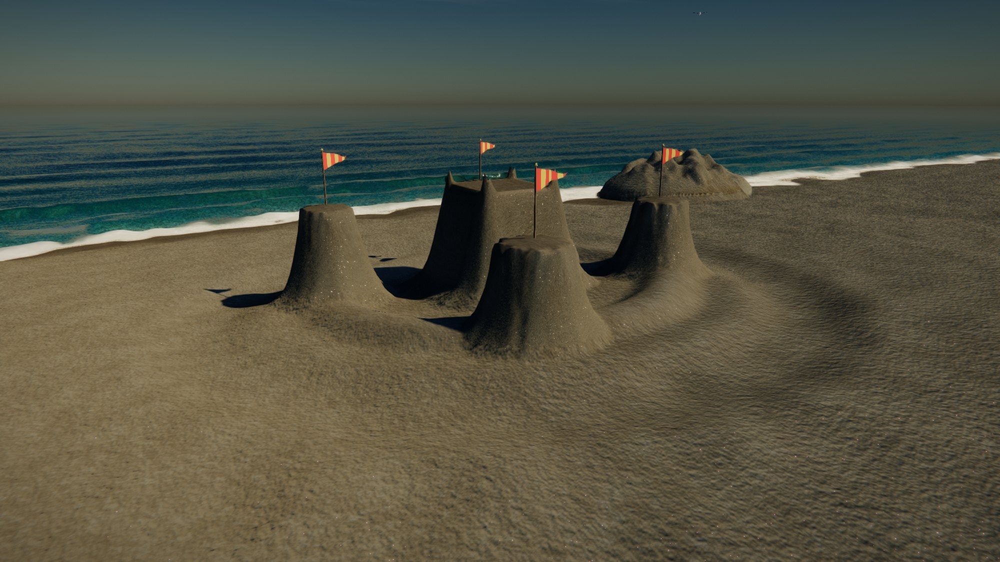
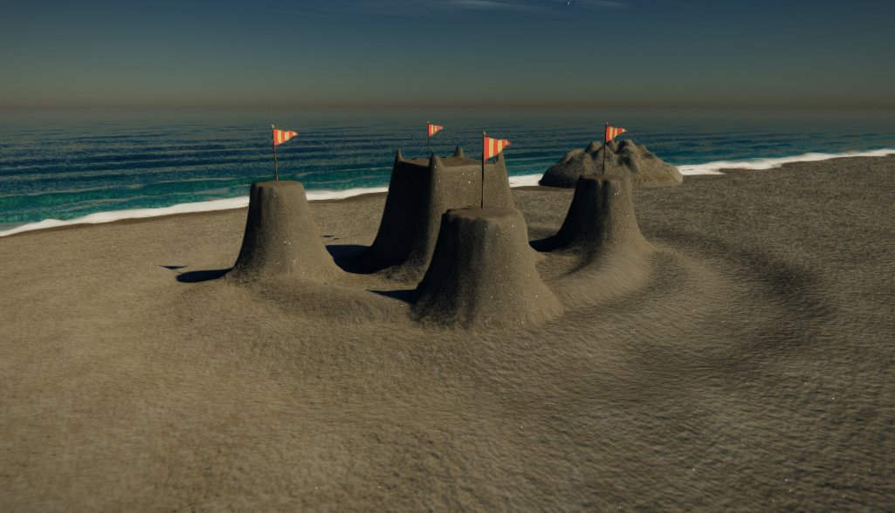
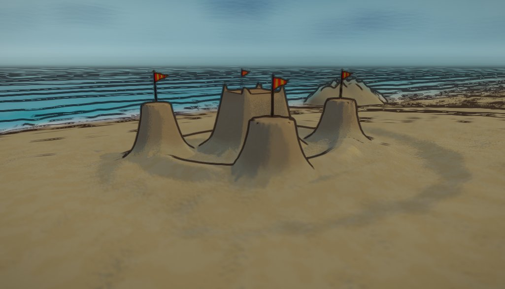
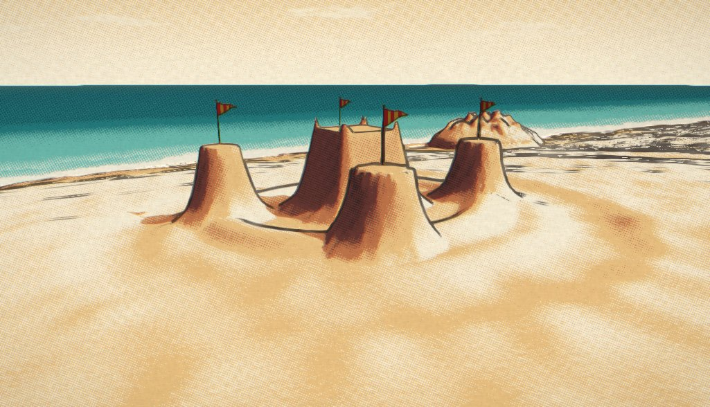
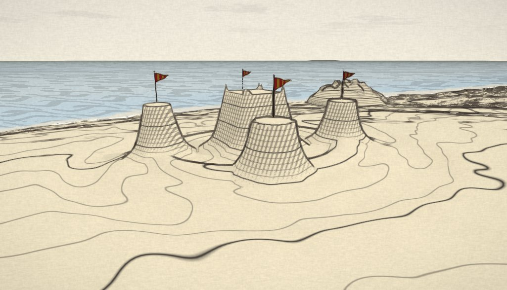
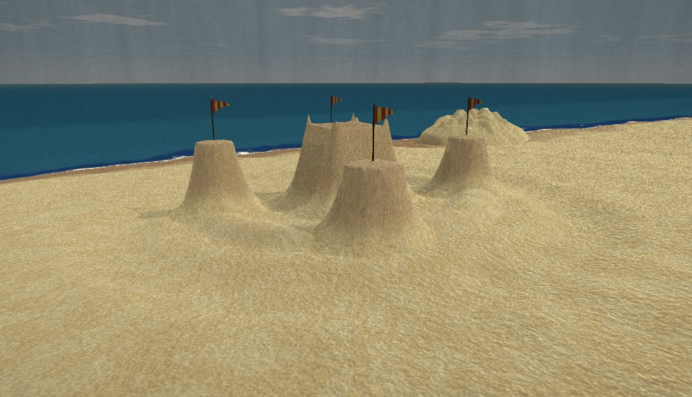
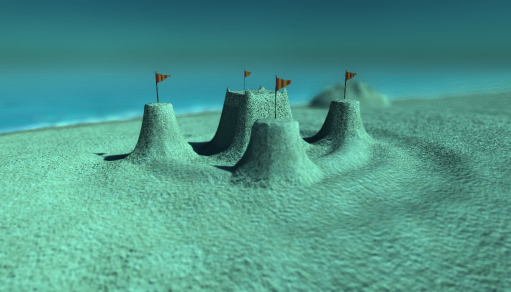
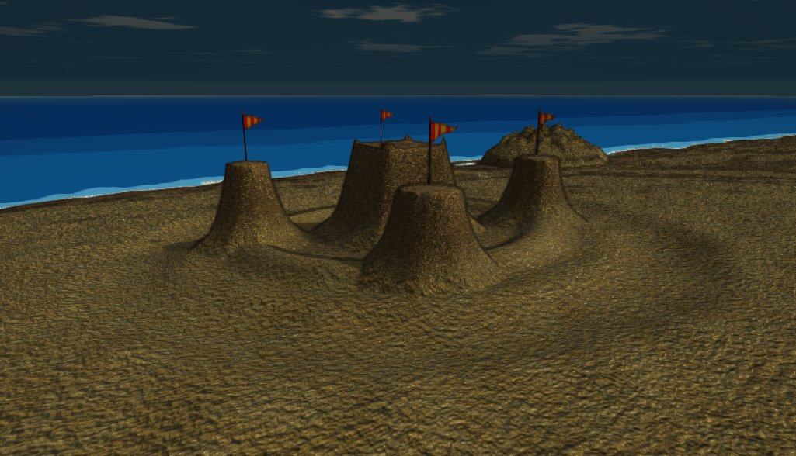
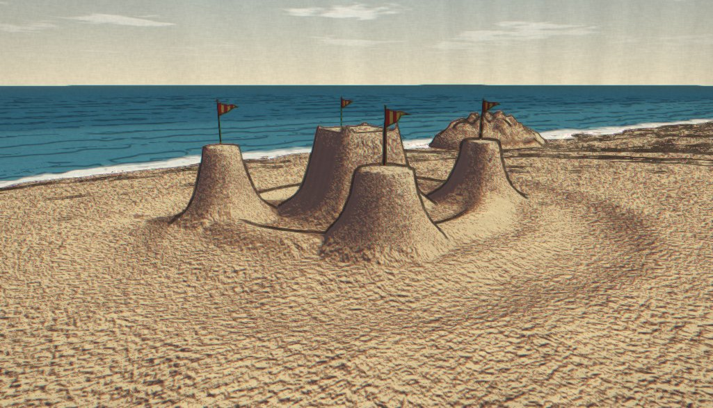
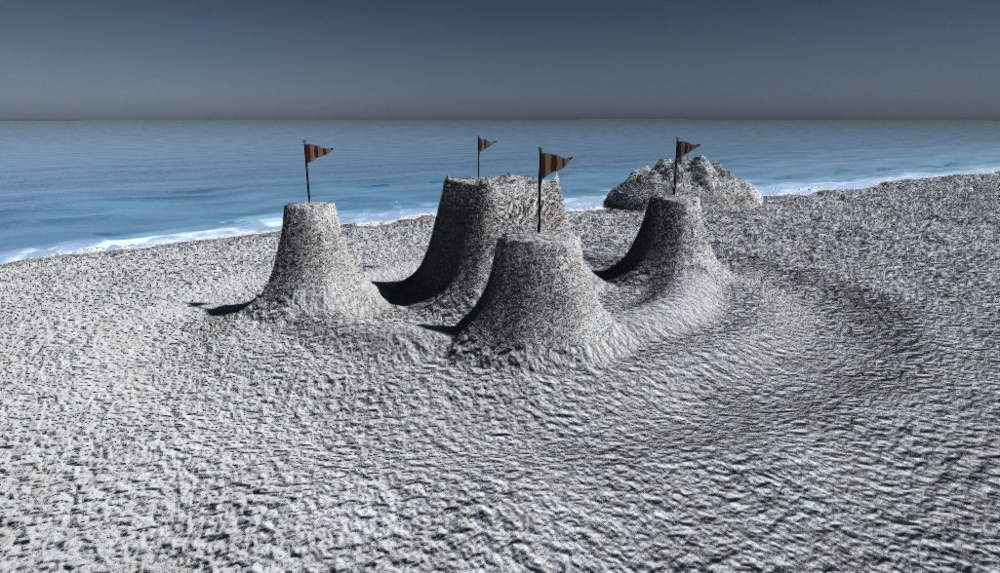

# TIDEWRIGHT — Nine Tides over Vellamar

**[▶ Play it in your browser](https://winchxyz.github.io/tidewright/)**

A 3D sandcastle simulator that runs entirely on the GPU. No engine, no
libraries, no asset files, no build step — one WebGL2 context, ~7 000 lines of
JavaScript and GLSL, and a beach that actually obeys the angle of repose.



> Long before the maps, this coast was a country. It sank in one night — not
> from war, but because it forgot its own name. The sea keeps what it takes,
> yet keeps it badly: every tide it tries to hand the kingdom back, grain by
> grain, and every tide it thinks better of it and pulls the whole thing under.
>
> *A tidewright is someone who catches the grains before the water changes its mind.*

### Built in one prompt

The whole thing — simulation, renderer, nine art styles, lore, interface — came
out of a single request to [Claude Code](https://claude.com/claude-code):

> *"Create me a fully playable release-ready game. On GPU. Game about sandcastle
> simulator, where I can build things with sand and etc. I need it in 3D and not
> a voxel game. Make it with maximum effort, show me best what you can create.
> Use all your power, knowledge and make best graphics and best game design.
> Surprise me with graphics, lore and everything."*

Everything after that was refinement in the same session. See
[the numbers](#the-numbers) at the foot of this file.

---

## Play

**In your browser:** <https://winchxyz.github.io/tidewright/>

**From a file:** clone and double-click `index.html`. Every script is a classic
`<script src>` tag, so it just runs from `file://` with no server. (Only
`localStorage` is unreliable there — saving is wrapped in a fallback and
degrades to in-memory.)

**From a server**, if you want saves to persist:

```bash
node server.js
```

then open <http://localhost:5173>.

### What it needs

WebGL2 with `EXT_color_buffer_float` and `EXT_float_blend` — any Chrome, Edge or
Firefox from the last few years, on a GPU from roughly the last decade. Safari 16+
works. If float render targets aren't available it says so plainly rather than
showing you a black screen.

It renders at your display resolution by default; drop **Render scale** in
Settings if your GPU is having a hard time. There is no network traffic of any
kind after the initial page load.

---

## The Curve — pons edition

The fourth way in. **The chart is the tide.** Pick any [pons](https://docs.ponsfamily.com)
v2 launch on Robinhood Chain (4663) and the game reads its bonding curve
straight off the chain, every six seconds, with raw JSON-RPC and no libraries:

- **The water sits at the price's recent high** (the last 20 minutes, by
  default). Every percent the price falls from that peak walks the sea up the
  shore; 30 % down and it is at the high-water line, taking the loose sand
  first and the feet before the towers. Buys draw the water back.
- **A sell lands as a wave.** The reserves moving between two polls is a
  trade; a sell throws a splash on top of whatever the drawdown already says.
- **Your bag is your pail.** Connect a wallet (it is switched to Robinhood
  Chain for you) and every 0.1 % of supply you hold is 4 m³ more sand, up to
  40 m³. Buy and sell happen on the curve itself, quoted the way the pons
  docs quote them — fees off the input on a buy, off the output on a sell,
  snipe tax read per recipient — and your wallet signs every transaction.
  Nothing here custodies anything.
- **Graduation is slack water.** When the curve fills, the pool is locked and
  the sea stops climbing for good.
- <kbd>R</kbd> rehearses a rug: thirty seconds of high water, nothing on the
  chain touched.

Point it at a launch with `?token=0x…`, tune the tide with `?flood=0.3`
(drawdown that is full flood) and `?window=20` (minutes the peak is measured
over). The picker lists the latest launches off the factory, busiest first.
Only v2 launches have a curve to read; a v1 token is politely refused.

`node server.js` also forwards `POST /rpc` to the chain, for a browser that
will not talk to the RPC directly. Everything else — `js/pons.js`, one new
HUD card, two screens — is the same zero-dependency beach.

## The game

There are three ways in.

**Slack Water** is the cozy one, and it's where the day lives. No tide, no
clock, every mould and every toy unlocked, and a full sunrise-to-stars day
cycle running over the shore — the sun comes up behind the dunes and goes down
over the water, which is the entire reason anyone builds on a west-facing
beach. Scrub the time with the slider, hold it where you like it, or let it
run at *slow*, *gentle* or *brisk*. Two soft tides walk up to the edge of your
work across the day and walk back again, and neither of them takes anything.

**Endless Sand** takes the arithmetic away. The pail is bottomless and the sea
stays where it is, so you can build without first working out where the material
is coming from. Everything else is the same beach — sand still slumps at its
angle of repose, still needs wetting to stand, still sets as it dries. You are
only spared the bookkeeping.

**The Novena** is the campaign: nine tides, each giving you a stretch of low
water to build in and then taking it back, higher and rougher each time, from
high morning at the first tide to full dark at the ninth. Between them the sun
crosses the sky exactly once — the light in tide V is not a different preset,
it is the same sun, lower.

Your score is **Remembrance**: sand you have raised above the coming
high-water line, weighted by how well you packed it. Loose sand counts for
almost nothing. The sea knows the difference and so does the scoreboard.

### The one law

**Dry sand cannot stand.** Each grain has an angle it refuses to exceed — about
33° dry. Water bridges the grains and lets you go past vertical. Too much water
and the bridges join up, the capillary squeeze disappears and it runs like
soup. Then **pat it**: compaction is the other half of strength, and a damp
packed wall will outlive an unpacked one by whole tides.

A readout follows your cursor with the moisture, the packing, how much sand is
left above the hardpack, and a plain-English verdict — *damp — good, now pat
it*, *soaked — it will run*, *hardpack — nothing left to dig*. Learn to read
it and the rest of the game follows. A single line above the workbench always
says the next useful thing.

## The interface

Four places, not six.

- **Left column** — where you are in time. In the Novena: the tide, its clock,
  and what it asks of you, with a water gauge below it whose labels ride their
  own marks so the card *is* the diagram. In Slack Water the same slot holds
  the day instead — dial, clock, phase, scrub and speed.
- **Top right** — what you have. Remembrance, which counts up rather than
  snapping, and the pail.
- **Bottom centre** — what you are doing, stacked over your hands: the next
  instruction, the selected tool's settings, and the rack. Fold the settings
  away with <kbd>Tab</kbd>.
- **At the cursor** — what the sand is actually like. It flips above and to
  the left near the edges so it never lands on anything.

One surface, one radius, one type ramp throughout.

### The pail

Sand is conserved to the grain. Digging fills your pail; pouring empties it.
You are not making sand, you are moving the coast around — so dig your moat
*where you want a moat* and the spoil becomes your keep. The classic beginner's
mistake is a borrow pit behind the castle, which the sea then climbs like a
stair.

The transfer is real, not bookkeeping. Sand you pour leaves the spout as tens
of thousands of GPU-simulated grains that arc, fall, and only raise the ground
*where they actually land* — pour off a ridge and the pile forms downslope,
where the sand went, not under the cursor. The spade throws a visible sheet
back over your shoulder as you drag it, and the mould lifts sand over its rim
as it fills. Deposition is exact: each grain scatters its volume across
precisely twenty-five texel centres, so what leaves the pail is what arrives.

And the pail remembers. Its wetness is the volume-weighted average of
everything you have shovelled into it, so sand collected wet stays wet when you
pour it — enough to stand steep the moment it lands. Left alone it dries in the
sun at about a percent a second, and the pail chip in the HUD tells you where
it is. Wet a patch before you dig it and you are carrying mortar; dig the dry
back-beach and you are carrying dust.

There is close to two metres of loose sand over the hardpack across a working
area some 36 m wide, which is deep enough that a proper moat cuts below sea
level — and when it does, it fills with water on its own. Nothing scripts
that; the sea surface simply renders wherever it is above the ground.

### Which tool does what

Every tool is tagged in the interface with what it does to the *amount* of
sand in the world, because that is the only real distinction between several
of them:

| | |
|---|---|
| **takes sand** | Shovel, Carve — into your pail |
| **adds sand** | Pail, Mould, Rampart, Drip — out of your pail |
| **no sand** | Pat, Water, Level, Adorn — changes what the sand is *like* |

**Water** and **Drip** are the pair people mix up. Water raises the moisture
of sand that is already there so it can stand steeper; it builds nothing.
Drip takes sand *from your pail* and dribbles it out already soaked, a blob at
a time, to grow spires. Water changes what's there; Drip adds new.

The two sand-takers differ in what they leave behind: the **Shovel** bites wide
and shallow and banks the ground's wetness into your pail as it goes, while
**Carve** cuts a narrow, deep line for gates and stairs. Both throw the spoil
where you can see it.

### The moulds

Ten plastic shapes out of the bottom of the beach bag: round turret, square
keep, gatehouse, star fort, ziggurat, spire, scallop, fish, crab, starfish.

They work the way they work on a real beach — in two halves:

1. **Hold** the mouse on damp sand. The mould scoops itself full; the meter
   fills and shows you how wet the sand going in is.
2. **Let go, aim, click.** The outline of the shape is drawn on the sand under
   your cursor, exactly as it will turn out — line it up, turn it with `,` and
   `.`, and press.

What comes out is precisely as wet as what went in. Turn out a dry mould and
it collapses into a cone in front of you. Turn out a soaked one and it runs.
Wet the ground *before* you scoop.

### Adornments

Twelve of them: pennant, parasol, pinwheel, lantern, pail-and-spade, toy boat,
scallop, starfish, driftwood, kelp, bottle, cairn. The pinwheel spins with the
wind, the parasol and the sails and the kelp move in it, the lanterns actually
light the sand around them, and all of them lean as the sand shifts underneath
and go over when the water reaches them.

### The sea

Waves break where the water goes thin, and they take the bottom of a wall
first. Nothing here is knocked over; things are undermined and then fall. A
moat *spends* a wave — filling a ditch is work, and the work comes out of the
wave. A packed berm on the seaward side turns what's left. The surface film runs
downhill and soaks in where it settles, and sand that saturates loses almost all
of its angle of repose — so a moat draining landward doesn't wash your keep away,
it quietly turns the ground under it to slurry, which is worse.

---

## Nine looks

Settings → **Look**. Same simulation, same sun, same castle — only the shading
changes, and it changes live. All nine are one `uStyle` uniform threaded
through the terrain, water, sky, prop and composite shaders. Not nine
renderers; nine ways of separating the same light.

The same castle, nine times:

| | | |
|:-:|:-:|:-:|
| <br>**Salt & Light** | <br>**Bucket & Spade** | <br>**Marram** |
| <br>**Ordnance** | <br>**Felt & Flannel** | <br>**Rockpool** |
| <br>**Tin Toy** | <br>**Sōsaku Hanga** | <br>**Midwinter** |

| | |
|---|---|
| **Salt & Light** | The shore as it is. Oren–Nayar sand with mica glints, Gerstner sea with refraction and Beer–Lambert extinction, raymarched atmosphere, HDR bloom. |
| **Bucket & Spade** | A picture book. Three flat steps of light with a *coloured* shadow — warm under a low sun, cool under a high one — flat painted sand, three greens of sea, a brown ink line from a Laplacian of depth, and a shallow miniature focus. |
| **Marram** | A screen-printed travel poster. Light isn't shaded, it's *separated*: five inks with a rotated dot screen between each pair, one ink pulled out of register, printed on visible paper. |
| **Ordnance** | A survey chart of your own castle. Contour lines straight off the heightfield, tightening into hachures on the steep faces, engraved wave marks on the sea. The only look that could not exist in a game that wasn't a heightfield — and the only one that tells you something about the terrain while you build it. |
| **Felt & Flannel** | A craft-fair diorama. Wrap lighting, no specular anywhere, fibre in the fill and a fuzzy halo on every silhouette. |
| **Rockpool** | The whole shore under a foot of clear water. Caustics crawling across the sand, a green cast, a slow refractive wobble and a soft focus. |
| **Tin Toy** | Enamel over pressed tin. Four hard steps, a banded highlight, litho dots in the paint, wear where the curvature is high. |
| **Sōsaku Hanga** | Woodblock. Flat colour blocks with grain in the fill, a hand-gradated *bokashi* sky, a ragged key line and a misregistered plate. |
| **Midwinter** | The same beach out of season. The realistic render, drained and cooled. |

## Controls

| | |
|---|---|
| Left mouse | use tool |
| Right drag · Shift + drag | orbit |
| Middle drag · Alt + drag | pan |
| Wheel | zoom |
| Shift + wheel | brush / object size |
| W A S D · Q E | pan · rotate |
| Shift + W A S D | pan faster |
| 1 – 9 , 0 | select tool |
| `[` `]` | brush / mould size |
| `,` `.` | turn the mould (Shift for 5°) |
| Shift *held during a stroke* | 35% tool strength, for fine work |
| Z | undo stroke (10 deep) |
| R | call the tide in early |
| P | photo mode |
| H | hide interface |
| Esc | pause |

**Tools** — Shovel, Pail, Pat, Water, Mould (hold to fill, click to turn out),
Rampart (drag to raise a wall to your starting height), Carve (press on the
level you want and drag: everything you cross comes down to it, so a stroke
across a wall leaves a gateway), Level, Drip (grows the knobbled spires only a
beach can make), Adorn. They unlock across the first five tides; Slack Water and
Endless Sand give you all of them at once.

One honest limit worth stating up front: the sand is a **heightfield** — one
height per column — so it can make notches, gateways, moats and overhanging
crenellations, but it cannot make a tunnel, a cave, or an arch with sand over
the top. Nothing in the game fakes it. A doorway here is a slot cut from the
top down, which is how real crenellations work too.

**Photo mode** gives you the sun on a slider, exposure, focus and aperture, and
writes a PNG.

---

## What's actually running

Everything expensive is on the GPU. There is no mesh file, no texture file and
no third-party code anywhere in this project.

**Sand in transit is real.** Pouring and dripping don't edit the ground — they
throw sand into the air. Each grain is a GPU particle carrying an exact volume
and the moisture it left with; it falls, it collides with the heightfield, and
when it lands it is drawn as a 5-pixel point into a scatter target that the
next simulation step folds into the ground. A 5-pixel point covers exactly 25
texel centres whatever its sub-pixel position, so an even 1/25 share returns
precisely the volume it was carrying: **measured loss is 0.04%.** That matters,
because the pail meter is derived from the total sand in the field and would
drift otherwise.

The consequences aren't scripted. Pour dry sand and it builds a cone at the
angle of repose while you watch. Drip very wet sand onto the same spot and it
stands in a near-vertical spire on a dry base spreading at 33° — two materials,
one solver. Sand in the air belongs to neither the pail nor the ground, so the
pail meter accounts for it separately while it's falling.

**And it sets.** Water is what lets you build the face; *packing* is what holds
it up, and packing doesn't evaporate. Sand that dries out of a wet state gains
compaction rather than losing strength — the bridges between the grains go, but
the grains stay locked where you pressed them and the surface crusts. So a
turret you mould at noon is still exactly as tall when it has dried bone dry:
measured, a 1.9 m tower goes from 87% moisture to zero and loses **0.000 m**.
Loose dry sand still can't hold anything — pour a heap from a dry pail and it
slumps half a metre in eight seconds. Packed and dry is strong; loose and dry is
not, which is the actual distinction on a real beach.

Digging stays instant. Responsiveness matters more there than spectacle.

**The ground** is a continuous heightfield — not voxels — solved in a fragment
shader over ping-ponged `RGBA32F` targets at up to 640². Per cell: sand depth,
moisture, compaction, surface water film. Each step does an eight-neighbour
avalanche relaxation against a *variable* angle of repose:

```
repose(moisture, compaction):
    dry            →  ~33°     a slope, never a wall
    damp + packed  →  past vertical
    saturated      →  it runs
```

Every transfer between two cells is computed from an antisymmetric expression
evaluated identically from both sides, so sand is conserved exactly — verified
over 12 000 steps with zero drift. That is what makes the pail meter honest,
and it is why an undermined wall collapses on its own rather than because
something scripted it.

Waves don't have a separate erosion rule. Breaking water simply *fluidises* the
sand — it drives the local repose angle toward zero and raises the relaxation
rate — and undermining, slumping and offshore bars all fall out of that.

**The water** is a Gerstner sum with real shoaling: amplitude gains as the
bottom comes up, crests get depth-limited, and the excess becomes foam. The
grid is exponentially warped around the camera, so the same ~740 k vertices
give 15 cm of detail at your feet and still reach the horizon. The simulation
and the renderer call the *same* GLSL wave function, which is why the erosion
lines up with the water you can see.

**The sky** is a raymarched Rayleigh + Mie atmosphere baked into a lat-long LUT
once a frame. Everything reads that one texture — sea reflections, ambient on a
sand wall, aerial perspective on the headland — so when the sun goes down the
whole world goes down with it.

**The sand shader** does Oren–Nayar diffuse (sand is the roughest thing on a
beach), wetness that darkens albedo and drops roughness, heightfield horizon
AO, procedural ripples, shell grit, heavy-mineral ribbons in the swash zone,
caustics under standing water, and a sparse mica glint field — the reason real
sand sparkles and CG sand usually doesn't. Steep faces switch to a wall
projection so moulded towers don't smear.

**The moulds** are one function, `mouldShape()`, living in the shared GLSL:
coverage and height over a unit disc. The simulation stamps with it and the
sand shader draws the ghost outline under your cursor from the very same code,
which is why the shape you line up is exactly the shape that turns out — there
is no second, approximate preview to drift out of sync.

**Also:** 6 000 particles integrated with transform feedback and colliding with
the heightfield; PCF shadows; a bloom pyramid, sun shafts, ACES with a split
grade, grain and FXAA; twelve procedurally generated beach toys that lean as
the sand moves under them and go over when the water reaches them — the
pinwheel spins with the wind, the parasol and sails and kelp move in it, and
the lanterns light the sand around them for real; and an entirely synthesised
soundtrack — surf built from three bands of filtered noise (body, break and
hiss) driven by the real swash phase, wind, gulls, and a modal pad through a
generated reverb.

**And crabs.** Eleven of them, wandering the beach in bursts and sitting still
between them, walking sideways because that is what crabs do. Their legs run off
a single gait phase that only advances while they are actually moving, so they
stop dead rather than treading air. They ride the heightfield like everything
else, so they will walk up over a rampart you have just raised. They keep to the
band above the waterline, which means a rising tide herds them up the beach
ahead of it without anyone having written a retreat — and if you bring a tool
near one, it bolts.

Measured on an RTX 4070 Laptop at 1600×900 internal, High preset: ~5–6 ms a
frame. Low / Medium presets scale the simulation, shadow map, water grid and
render scale for weaker hardware.

---

## Files

```
index.html          markup, all overlays
css/ui.css          interface
js/core.js          math, GL wrapper, async PBO readback, storage
js/glsl.js          shared GLSL: noise, the beach profile, the wave field, BRDF
js/sky.js           atmosphere LUT + background (sun, moon, stars, clouds)
js/sim.js           the sand — avalanche, moisture, tools, AO, metrics, picking
js/terrain.js       sand surface renderer
js/water.js         the sea
js/props.js         procedural adornments, gulls and crabs
js/particles.js     GPU particles (transform feedback)
js/post.js          bloom, shafts, DOF, tonemap, FXAA
js/audio.js         synthesised everything
js/content.js       the nine tides, the tools, the codex — all the design knobs
js/game.js          camera, input, tide state machine, scoring, interface
server.js           31-line static server, optional
docs/               the screenshots in this file, nothing the game loads
```

Everything a designer would want to touch — tide heights, durations, swell,
sun angles, objectives, tool rates, the codex — is in `content.js` and the
brush block of `sim.js`.

---

## Codex

Nine entries from *The Tidewright's Primer* unlock as you go, plus two hidden
ones. They are the manual, in character.

> You will be told that a tidewright works to preserve something. That is a
> misunderstanding, and a comfortable one. Nothing you make here survives.
> What a tidewright preserves is the *shape* — the fact that this arrangement
> of grains was possible, was chosen, was made by somebody on purpose on an
> ordinary afternoon. The sea can have the sand. It has never once managed to
> take the fact.
>
> Hold the shape. Then let go of it. Then do it again.

---

## The numbers

TIDEWRIGHT was written in one continuous session with
[Claude Code](https://claude.com/claude-code) (Opus 5), from the single prompt
quoted at the top of this file. For anyone curious what "one prompt" actually
costs:

| | |
|---|---|
| Model | Claude Opus 5 |
| Wall clock | 7 h 47 m, one sitting |
| Time actually working | 6 h 45 m |
| Assistant turns | 2 596 |
| Tool calls | 1 680 |
| Tokens written by the model | 2.61 M |
| Prompt cache reads | 900.8 M |
| Cache writes | 39.7 M |
| **Total tokens** | **943.2 M** |
| Lines shipped | 7 145 across 15 files |
| Dependencies | 0 |

Ninety-five percent of that total is prompt cache reads. The whole codebase gets
re-read on nearly every turn, which is exactly what lets a project this size hold
together inside one conversation — and why the *generated* figure (2.6 M) is the
one that reflects the actual writing.

## Licence

MIT — see [LICENSE](LICENSE).
